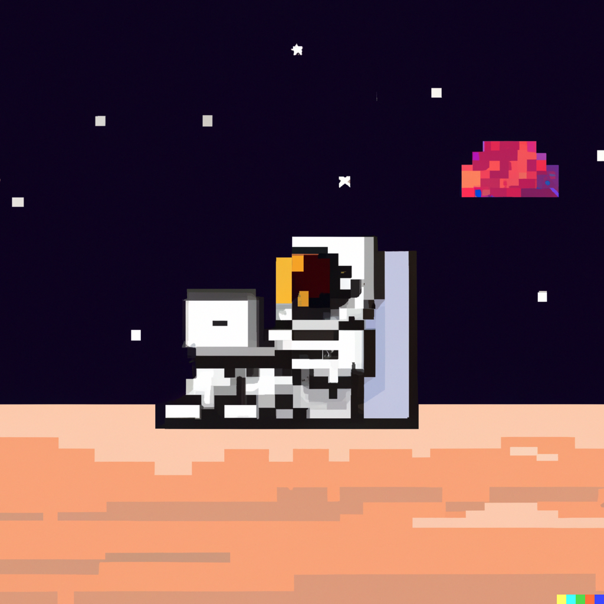

 

<h4 align="center"><samp> Sawadee Kraab 🇹🇭 ✌️  Welcome to my Github!</samp>
</h4>
 

  

 
<h4 align="center"><samp> I'm a Fullstack Developer and Tech Enthusiast. I also love Javascript and Typescript equally (but currently trying out Golang 🤢🤮). I'm currently exploring AI since it's like the future and stuff 💻🤖☁️ </samp>
</h4>

 
 

<!--  -->

**languages and tools:**  

<code></code>
<code></code>
<code></code>
<code></code>
<code></code>
<code></code>
<code></code>
<code></code>
<code></code>
<code></code>
<code></code>

 

<!--
**053steve/053steve** is a ✨ _special_ ✨ repository because its `README.md` (this file) appears on your GitHub profile.

Here are some ideas to get you started:

- 🔭 I’m currently working on ...
- 🌱 I’m currently learning ...
- 👯 I’m looking to collaborate on ...
- 🤔 I’m looking for help with ...
- 💬 Ask me about ...
- 📫 How to reach me: ...
- 😄 Pronouns: ...
- ⚡ Fun fact: ...
-->
